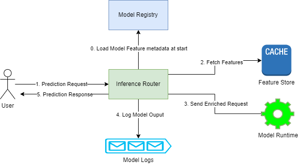

# Litti-ML

Litti-ML is an extensible ML inference engine, which natively understands model and feature metadata in inference
context.

## High Level Prediction flow

1. Request is sent from client to inference router.
    1. Inference router is already aware of features required for inferencing because it can access management server at
       startup.
    2. Inference router queries the relevant feature stores to add feature values to prediction request.
2. Inference router forwards the request to prediction runtime.
3. Prediction Runtime does model computation and returns result to inference router.
4. Inference router logs model prediction and returns response.

## Goals:

1. Define specifications and add examples for multi-framework inference support for most jvm based frameworks.
2. Define specifications and add examples for multi-framework inference support for non-jvm based frameworks.
3. Define specifications for an extensible integration of inference feature stores.
4. Define specifications for model and feature store inference telemetry for platform engineers.